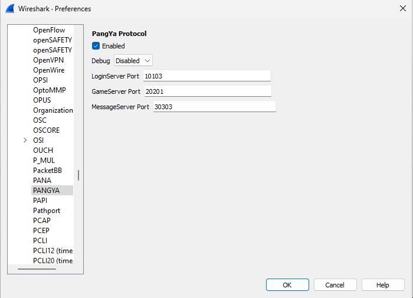

# Wireshark dissector for PangYa
_This project is not endorsed by or related to Ntreev Soft Corporation. See [Trademark Notice](#trademark-notice) for more information._

This is a Lua plugin for Wireshark that provides dissection of the PangYa network protocol.

To use, copy `pangya.lua` into your "Personal Lua Plugins" or "Global Lua Plugins" folder in Wireshark. To get to these folders easily, use Help -> About Wireshark, and go to the Folders tab. Clicking on the hyperlink for a given location will prompt it to be created if it doesn't exist, then should open your file manager. You can then paste the Lua plugin file (pangya.lua) there.

In general, there is no need to configure the plugin; by default, it will behave similar to Pantrant. However, if you have unusual ports in your dump or you want to debug the plugin itself, the preferences panel contains some useful options.

**Please Note**: This software is not well-tested, and should probably be considered alpha-quality. You may find it useful, but it is likely buggy.

In addition, this does not support unofficial servers in any way. They may work, but only dumps using official clients and servers are in scope.

## Trademark Notice
PangYa is a registered trademark of Ntreev Soft Co., Ltd. Corporation. This software is not endorsed or related to Ntreev Soft Co., Ltd. Corporation in any way. "PangYa" and related trademarks are used strictly for purposes of identification.
